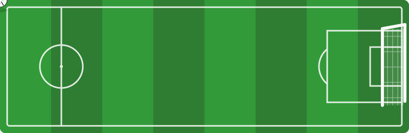
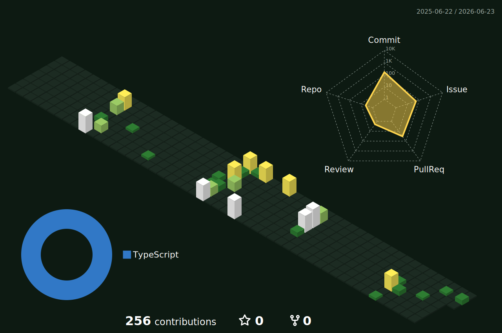

<!--
============================================================
  GitHub プロフィール用 README
  配置先: リポジトリ「Yamada040/Yamada040」のルートに README.md として置く
============================================================
-->

<!-- ===== Header: 波のバナー ===== -->
<div align="center">
  
</div>

<!-- ===== タイピングアニメーション ヘッダー ===== -->
<div align="center">
  <a href="https://github.com/Yamada040">
    
  </a>
</div>

<div align="center">
  
</div>

<!-- ===== Football scene (animated SVG) ===== -->
<div align="center">
  
</div>

<br/>

<!-- ===== Intro ===== -->
### 👋 Hi there, I'm Yamada

A frontend developer building web applications with **Next.js** & **React**, and exploring **AI / LLM-powered products** 🤖.
I like turning rough ideas into polished UIs and shipping things that people actually use.

⚽ **Off the keyboard**, I'm a football fan — I love the beautiful game as much as a clean, well-built interface.
Watching, playing, and the occasional late-night match: football keeps me sharp, just like a good refactor.

**⚡ Tech Interests & Skills**
- Next.js / React / TypeScript
- AI / LLM Integration (Claude, Vercel AI SDK)
- Frontend Architecture & UX
- Always exploring new tools & frameworks

<br/>

<!-- ===== About (code block) ===== -->
<div align="center">

### 🧑‍💻 About Me

</div>

```typescript
const yamada = {
  role: "Frontend × AI Developer",
  stack: ["Next.js", "React", "TypeScript"],
  focus: ["AI / LLM Integration", "Web Applications"],
  currentlyLearning: "Agentic AI & RAG pipelines",
  hobbies: ["⚽ Football", "📚 Tech reading"],
  motto: "Build clean. Ship fast. Play hard. 🚀",
};
```

<br/>

<div align="center">
  
</div>

<!-- ===== Tech Stack ===== -->
<div align="center">

### 🛠️ Tech Stack

<!-- Frontend -->


<!-- AI / LLM -->


<!-- Runtime / Tooling -->


</div>

<br/>

<div align="center">
  
</div>

<!-- ===== 3D Contribution Graph ===== -->
<!--
  下の 3D グラフは GitHub Actions (.github/workflows/profile-3d.yml) が
  profile-3d-contrib/ 配下に自動生成します。初回はアクション実行後に表示されます。
-->
<div align="center">

### ⚽ My Contributions on the Pitch (3D)



</div>

<br/>

<div align="center">
  
</div>

<!-- ===== GitHub Stats ===== -->
<div align="center">

### 📊 GitHub Stats


<br/>


<br/>


<br/>


</div>

<br/>

<!-- ===== Contribution Snake ===== -->
<div align="center">
  
</div>

<br/>

<div align="center">
  
</div>

<!-- ===== Connect ===== -->
<div align="center">

### 🌐 Connect with me

[](https://github.com/Yamada040)
[](https://qiita.com/Yamada040)
[](https://zenn.dev/shutingstar)
<!-- X はユーザー名が決まったらリンクを差し替えてください -->
[](https://x.com/)

</div>

<br/>

<!-- ===== Footer: 波のバナー ===== -->
<div align="center">
  
</div>
